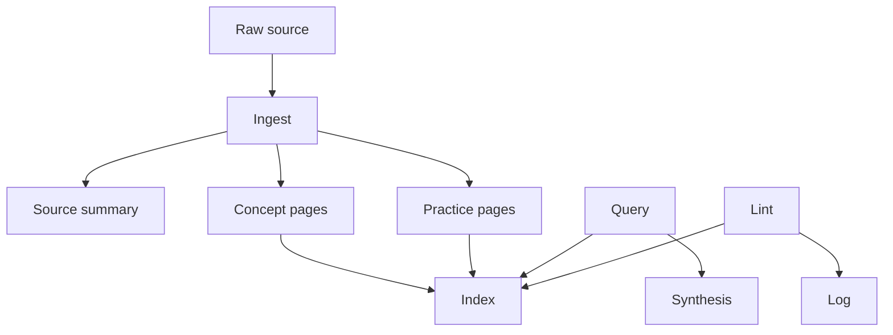

# Software Developer Ontology Overview

## Summary

This workspace turns software-development knowledge into a maintained graph of markdown pages. The first version models five core questions:

1. Who is the knowledge for? [[concepts/software-developer|Software developer]].
2. What domain is being modeled? [[concepts/software-engineering|Software engineering]].
3. How is knowledge structured? [[concepts/ontology|Ontology]].
4. How does knowledge accumulate? [[concepts/llm-maintained-wiki|LLM-maintained wiki]] and [[concepts/knowledge-compounding|Knowledge compounding]].
5. How is the system maintained? [[practices/ingest|Ingest]], [[practices/query|Query]], and [[practices/lint|Lint]].

## Initial map

## Evidence vs. inference

- Source-backed: the raw/wiki/schema architecture, ingest/query/lint operations, and index/log split come from [[sources/karpathy-llm-wiki|Karpathy LLM Wiki]].
- Inference: the specific software-developer entity and relation types are tailored for this workspace.

## Next useful expansions

- Add pages for `testing`, `debugging`, `code review`, `architecture decision record`, `technical debt`, `security review`, and `deployment`.
- Ingest real developer sources one at a time.
- Add richer lint checks only after the first few ingests reveal repeated maintenance issues.
